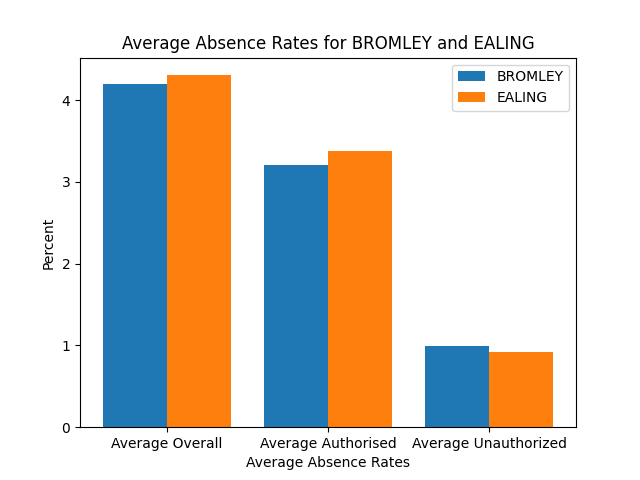
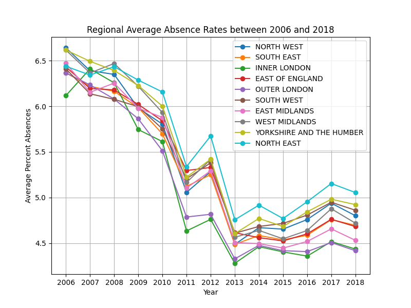
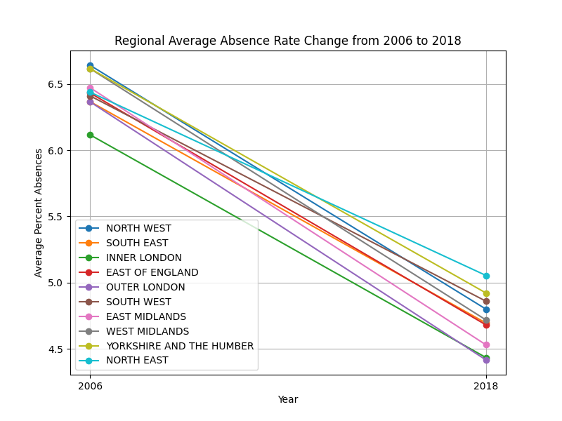
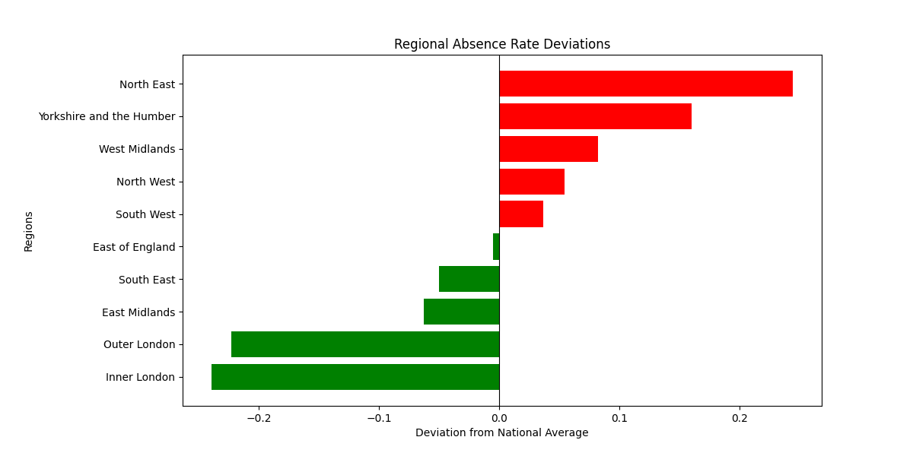
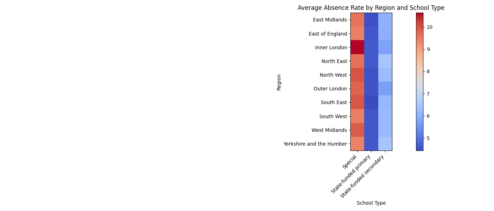

# England School Absence Analysis

## Table of Contents
- [Repository](#Repository)
- [Installation](#Installation)
- [Usage](#Usage)
- [Dataset](#dataset)
- [Notes](#Notes)
- [Example Usage](#Example-Usage)

### Repository
```
├── README.md                     
├── requirements.txt    
│          
│
├── src/
│   ├── main.py
│   ├── queries.py
│   └── util.py
│
│
├── example_plots/
│   ├── avg-absence-rate-by-region-school-type.png
│   ├── avg-absence-rates.png
│   ├── regional-absence-rate-deviations.png
│   ├── regional-avg-absence-rate-change-2006-18.png
│   └── regional-avg-absence-rates-2006-18.png
```

### Installation
1. Open the terminal and navigate into the source folder.
    ```bash
    $  cd spark-uk-attendance-app/src
    ```
1. Create a virtual environment:
    ```bash
    $  python3 -m venv my-env
    ```
2. Activate the environment:
    ```bash
    $  source my-env/bin/activate
    ```
3. Install dependencies using requirements.txt:
    ```bash
    $  pip install -r requirements.txt
    ```
4. Create a folder named data in the root of your repository.
5. Download the data set [from this page](https://explore-education-statistics.service.gov.uk/data-catalogue/data-set/097fd311-d368-4a12-ac38-45efab3f3f95) and place the file inside the data folder.

### Usage
1. Open the terminal, navigate into the source folder, and activate the virtual environment.
    ```bash
    $  cd spark-uk-attendance-app/src
    $  source my-env/bin/activate
    ```
2. Run the application:
    ```bash
    $  python main.py
    ```
3. Use the menu by typing the number corresponding to the task you want to perform (1-6), and then press 'return'.
4. To exit the program from the main menu, type '7' and then press enter.

### Dataset
:copyright: Crown Copyright, 2020, Department for Education \
This dataset, [Absence_3term201819_nat_reg_la_sch.csv](https://explore-education-statistics.service.gov.uk/data-catalogue/data-set/097fd311-d368-4a12-ac38-45efab3f3f95), is licensed under the [Open Government License 3.0](https://www.nationalarchives.gov.uk/doc/open-government-licence/).

You can download the dataset [from this page](https://explore-education-statistics.service.gov.uk/data-catalogue/data-set/097fd311-d368-4a12-ac38-45efab3f3f95)
You can find more information about the dataset [here]()

### Notes
- Years entered refer to the academic year starting in that year. 
    e.g. 2008 refers to the 2008-2009 school year.
- All text input commands must be followed by hitting the 'enter' key.
- You must exit out of the graphs/ charts to continue with the analysis.
- Improved functionality if you download the dataset to your local device. If you do not want to download the file, open main.py and follow the comments to uncomment/comment the relevant lines of code as instructed.

### Example Usage
```
=== School Absence Analysis Menu ===
1. Search enrolments by local authority.
2. Search authorised absences by school type.
3. Search unauthorised absences by region or local authority.
4. Compare 2 Local Authorities.
5. Explore performance of regions from 2006-2018.
6. Explore link between school type, location, and pupil absences.
7. Exit/ Quit
```
##### 1. Search enrolments by local authority.
    ```
    Enter your choice (1-7): #1
    Enter Local Authority name(s) to search for or 'ALL'. If providing a list, please separate names with commas. #Greenwick, Bromley, croydon
    GREENWICK not in list. If you meant 'GREENWICH', enter 'Y'. #Y

    +---------+-----------+----------+
    |la_name  |time_period|enrolments|
    +---------+-----------+----------+
    |Bromley  |2006       |39253     |
    |Bromley  |2007       |38883     |
    |Bromley  |2008       |38819     |
    |Bromley  |2009       |38594     |
    |Bromley  |2010       |38497     |
    |Bromley  |2011       |38412     |
    |Bromley  |2012       |38683     |
    |Bromley  |2013       |39336     |
    |Bromley  |2014       |39448     |
    |Bromley  |2015       |40162     |
    |Bromley  |2016       |40877     |
    |Bromley  |2017       |41818     |
    |Bromley  |2018       |42579     |
    |Croydon  |2006       |45789     |
    |Croydon  |2007       |44278     |
    |Croydon  |2008       |43645     |
    |Croydon  |2009       |43713     |
    |Croydon  |2010       |44065     |
    |Croydon  |2011       |45809     |
    |Croydon  |2012       |45863     |
    |Croydon  |2013       |46712     |
    |Croydon  |2014       |46947     |
    |Croydon  |2015       |48310     |
    |Croydon  |2016       |49480     |
    |Croydon  |2017       |49035     |
    |Croydon  |2018       |49489     |
    |Greenwich|2006       |30223     |
    |Greenwich|2007       |29519     |
    |Greenwich|2008       |29337     |
    |Greenwich|2009       |28740     |
    |Greenwich|2010       |28890     |
    |Greenwich|2011       |29214     |
    |Greenwich|2012       |29780     |
    |Greenwich|2013       |31047     |
    |Greenwich|2014       |31985     |
    |Greenwich|2015       |33330     |
    |Greenwich|2016       |34741     |
    |Greenwich|2017       |36441     |
    |Greenwich|2018       |36397     |
    +---------+-----------+----------+
    ```
##### 2. Search authorised absences by school type.
    ```
    Enter your choice (1-7): #2
    Enter school type to search for: #state-funded primary
    Enter the school year to search for: #2010

    +--------------------+--------------------+-------------------------+
    |school_type         |school_type         |total_authorised_absences|
    +--------------------+--------------------+-------------------------+
    |State-funded primary|State-funded primary|42540641                 |
    +--------------------+--------------------+-------------------------+

    Would you like to see the breakdown of types of authorized absenses? 
    Enter 'Y' for yes or press 'Enter' for no: #Y

    -RECORD 0----------------------------------
    school_type        | State-funded primary 
    time_period        | 2010                 
    medical_reasons    | 2506621              
    excluded_absences  | 165024               
    extended_holiday   | 135316               
    holiday            | 4975215              
    traveller_absences | 207560               
    illness            | 30825424             
    religious_reasons  | 1021372              
    study_leave        | 2404                 
    other              | 2594319              
    unknown            | 107386       
    ```
##### 3. Search unauthorised absences by region or local authority.
    ```
    Enter your choice (1-7): #3
    Enter 'R' to break down by region or 'LA' to break down by local authority: #R
    Enter school year to search for: #2012

    +------------------------+----------------------+
    |region_name             |sum(sess_unauthorised)|
    +------------------------+----------------------+
    |North West              |3371419               |
    |South East              |3439324               |
    |Inner London            |1406657               |
    |East of England         |2586847               |
    |Outer London            |2429522               |
    |South West              |1577276               |
    |East Midlands           |2083430               |
    |West Midlands           |2968629               |
    |Yorkshire and the Humber|2996594               |
    |North East              |1220367               |
    +------------------------+----------------------+
    ```
##### 4. Compare 2 local authorities.
    ```
    Enter your choice (1-7): #4
    Enter the first local authority for your comparison: #Bromley
    Enter the second local authority for your comparison: #Ealing
    Enter the school year to search for: #2016
    +-------+-------------+----------------+--------------+----------------+-------------+---------------+
    |la_name|total_schools|total_enrolments|total_absences|avg_absence_rate|avg_auth_rate|avg_unauth_rate|
    +-------+-------------+----------------+--------------+----------------+-------------+---------------+
    |Bromley|98           |40877           |617692        |4.20108         |3.20988      |0.99119        |
    |Ealing |89           |44018           |667038        |4.30525         |3.38101      |0.92424        |
    +-------+-------------+----------------+--------------+----------------+-------------+---------------+

    Overall Absence: BROMLEY is -2.42% lower than EALING.

    Authorised Absence: BROMLEY is -5.06% lower than EALING.

    Unauthorised Absence: BROMLEY is 7.24% higher than EALING.
    ```


##### 5. Explore the performance of regions between 2006 and 2018.
    ```
    Enter your choice (1-7): #5
    ```




    ```
    +------------------------+--------------------+
    |region_name             |avg_overall_absences|
    +------------------------+--------------------+
    |Inner London            |5.0758              |
    |Outer London            |5.0924              |
    |East Midlands           |5.2522              |
    |South East              |5.2651              |
    |East of England         |5.3102              |
    |South West              |5.3521              |
    |North West              |5.3698              |
    |West Midlands           |5.3972              |
    |Yorkshire and the Humber|5.475               |
    |North East              |5.5594              |
    +------------------------+--------------------+
    ```


##### 6. Explore the link between school type, location, and pupil absences.
    ```
    Enter your choice (1-7): #6

    +------------------------+----------------------+------------------+
    |region_name             |school_type           |avg_absence       |
    +------------------------+----------------------+------------------+
    |East Midlands           |State-funded secondary|6.038917777777779 |
    |East Midlands           |Special               |9.60436862385321  |
    |East Midlands           |State-funded primary  |4.512077179487179 |
    |East of England         |State-funded secondary|5.997705106382979 |
    |East of England         |State-funded primary  |4.589656099290781 |
    |East of England         |Special               |9.451066595744681 |
    |Inner London            |Special               |10.639678875739644|
    |Inner London            |State-funded secondary|5.730244792899408 |
    |Inner London            |State-funded primary  |4.635775989010989 |
    |North East              |State-funded primary  |4.640742435897435 |
    |North East              |State-funded secondary|6.474480064102565 |
    |North East              |Special               |9.636811602564103 |
    |North West              |Special               |9.989947845117847 |
    |North West              |State-funded secondary|6.271658316498316 |
    |North West              |State-funded primary  |4.54289936026936  |
    |Outer London            |Special               |9.800551943319837 |
    |Outer London            |State-funded secondary|5.703715222672064 |
    |Outer London            |State-funded primary  |4.5444170850202426|
    |South East              |State-funded primary  |4.43271983805668  |
    |South East              |Special               |9.984992995951417 |
    |South East              |State-funded secondary|6.162532226720647 |
    |South West              |State-funded secondary|6.221369444444444 |
    |South West              |Special               |9.464223461538461 |
    |South West              |State-funded primary  |4.592331901840491 |
    |West Midlands           |Special               |9.902291813186812 |
    |West Midlands           |State-funded primary  |4.623920549450549 |
    |West Midlands           |State-funded secondary|6.184046868131867 |
    |Yorkshire and the Humber|Special               |9.423262256410256 |
    |Yorkshire and the Humber|State-funded secondary|6.457833692307692 |
    |Yorkshire and the Humber|State-funded primary  |4.61274882051282  |
    +------------------------+----------------------+------------------+
    ```
